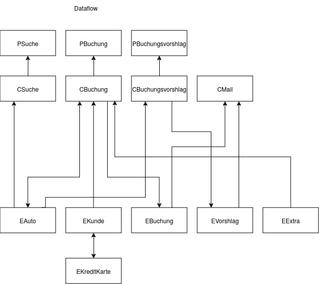
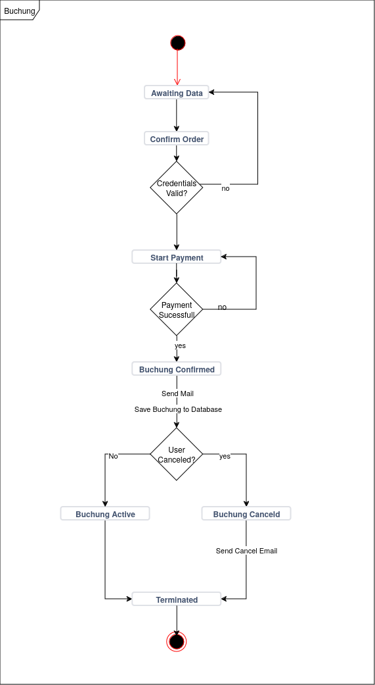
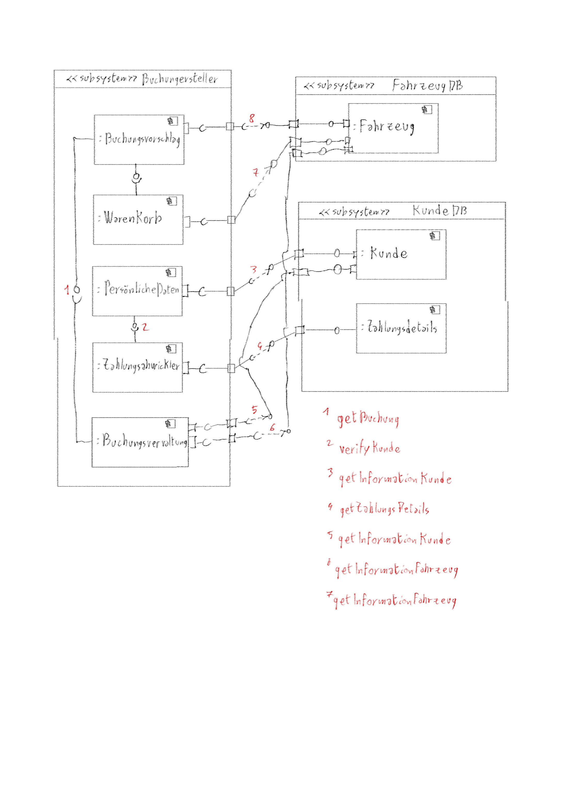

# Software Engineering

## Team Mitglieder
- [Dan Dumbrava](mailto:dan.dumbrava@student.unibz.it)
- [Nicolas Bonet](mailto:nicolas.bonet@student.unibz.it)
- [Massimiliano Mola](mailto:massimiliano.mola@student.unibz.it)

## Projekt 1

### Anwendungsfallmodell

#### Erklärung

Das Anwendungsfalldiagramm zeigt das Autovermietungssystem aus der Sicht des Kunden. Die dargestellten Anwendungsfälle beschreiben die Interaktionen zwischen Kunden und System durch den Austausch von Daten und die Erfüllung von Anforderungen. Die Hauptzugangspunkte für den Kunden sind die Buchung und die Anzeige von Mietangeboten. Jeder Anwendungsfall stellt eine notwendige Funktion für ein vollständiges, funktionales Autovermietungssystem dar.

### Anwendungsfallmodell mit Server

Das Anwendungsfalldiagramm zeigt Anwendungsfälle des Autovermietungssystems. Die meisten Fälle werden aus der Perspektive des Servers beschrieben. Nur der Anwendungsfall "Buchung" ist direkt mit dem Kunden verbunden.
Eingeschlossene Anwendungsfälle (Buchung, Buchungsinformationen und Alter, Persönliche Daten, Zahlungsdaten, usw.) sind notwendig, um Basis-Anwendungsfälle korrekt zu funktionieren (Buchungabschluss, Kostenvoranschläge Bereitstellung, Datenüberprüfung).

### Klassendiagramm (Einfach)

#### Erklärung

Der Benutzer enthält persönliche Daten und kann mit vielen Zahlungsdaten verbunden sein. Dem echten Kunden (nicht dem Objekt) werden Buchungsvorschläge gemacht, die auf dem Fahrzeug und der Buchungsdauer basieren. Ein Buchungsvorschlag wird als Vorlage genommen, um eine Buchung zu erstellen.
Dem echten Kunde (nicht das Objekt) werden Buchunsvorschlage gemacht, die basierend auf das fahrzeug und die Buchungsdauer sind.
Ein Buchungsvorschlag wird as template genommen um eine Buchung zu erstellen.

### Klassendiagramm (Erweitert)

#### Erklärung

Ein Benutzer könnte die Kreditkarte einer anderen Person nutzen, daher gibt es keine Aggregation zwischen der Karte und dem Nutzer. Jede Buchung basiert auf einem Buchungsvorschlag, daher ist der Vorschlag ein wichtiger Teil der Buchung. Die Rückgabe-/Abgabedaten und -orte sind Teil des Buchungsvorschlags, da sie als Parameter für die Vermittlungssuche verwendet werden. Das Attribut "Reduzierung" in den Buchungen enthält Informationen wie Aktionen oder Reduzierungen der Selbstbeteiligung gegen eine zusätzliche Gebühr. Da die Vorschläge können auch bei E-Mail angeboten sein, es besteht eine viele-zu-viele-Assoziation zwischen Buchungsvorschlägen und E-Mails, da ein Kunde mehrere E-Mails für einen Vorschlag senden und erhalten kann.

### Sequenzdiagramm

#### Erklärung
Das Sequenzdiagramm zeigt, wie ein Kunde Mietvorschläge basierend auf Alter und Anforderungen anfordert (*Kostenvoranschläge Bereitstellung* Anwendungsfall).
Der Suchvorgang startet in der Präsentationsschicht, durchläuft den Server, der Autos filtert, und greift auf die Autodatenbank zu. Gefilterte Autos werden als Mietvorschläge zurückgegeben und dem Kunden angezeigt.
Das Diagramm zeigt keine Fehlerbehandlung. P_SuchVorschlag kümmert sich um das GUI, um die Vorschläge dem Kunden anzuzeigen.

### Klassendiagramm mit funktionen

#### Erklärung
Das Diagramm beschreibt die Klassen, deren Methoden und die Abhängigkeiten zueinander, um eine Liste von Leihvorschlägen für den Kunden zu liefern. Der Kunde gibt auf der Seite SearchProposals sein Alter und seine Anforderungen an. Diese Informationen werden an den Server gesendet, der den SearchController verwendet, um eine Liste von Fahrzeugen zu erhalten, die den Anforderungen des Kunden entsprechen. Der C_Server übergibt anschließend die Liste der Fahrzeuge an die C_Proposal-Komponente und erhält eine Liste von Vorschlägen zurück. Diese werden dann an P_SearchProposal gesendet, das die Liste der Vorschläge dem Kunden grafisch anzeigt.

### TODO 

